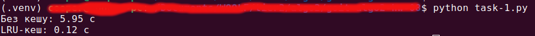

## Завдання 1. Оптимізація доступу до даних за допомогою LRU-кешу

Реалізуйте програму, що демонструє, як `LRU-кеш` пришвидшує багаторазові `«гарячі»` запити до великого масиву чисел.

### Технічні умови

1. Маємо масив `array` довжиною `N` зі строго додатних цілих чисел `(1 ≤ N ≤ 100 000)`. Необхідно обробити `Q` запитів `(1 ≤ Q ≤ 50 000)` двох типів

- `Range(L, R)` — обчислити суму елементів `array[L : R + 1]`.
- `Update(index, value)` — присвоїти `array[index] ← value`.

2. Реалізуйте чотири функції

   - `range_sum_no_cache(array, left, right)` — повертає суму без кешування.
   - `update_no_cache(array, index, value)` — оновлює елемент без кешування.
   - `range_sum_with_cache(array, left, right)` — виконує пошук у готовому класі `LRUCache (ємність K = 1000)`. Якщо `cache.get()` повертає `−1 (cache-miss)`, обчислює суму, зберігає її методом `put()` і повертає результат.
   - `update_with_cache(array, index, value)` — оновлює масив і видаляє всі діапазони з кешу, що містять змінений `index`. Інвалідація здійснюється лінійним проходом по ключах кешу — іншої модифікації класу не потрібно.

3. Для тестування використайте таку функцію для генерації масиву запитів:

```
import random

def make_queries(n, q, hot_pool=30, p_hot=0.95, p_update=0.03):
    hot = [(random.randint(0, n//2), random.randint(n//2, n-1))
           for _ in range(hot_pool)]
    queries = []
    for _ in range(q):
        if random.random() < p_update:        # ~3% запитів — Update
            idx = random.randint(0, n-1)
            val = random.randint(1, 100)
            queries.append(("Update", idx, val))
        else:                                 # ~97% — Range
            if random.random() < p_hot:       # 95% — «гарячі» діапазони
                left, right = random.choice(hot)
            else:                             # 5% — випадкові діапазони
                left = random.randint(0, n-1)
                right = random.randint(left, n-1)
            queries.append(("Range", left, right))
    return queries
```

Ця функція створює список із `50 000` запитів до масиву з `100 000` елементів. Три відсотки — це оновлення окремих елементів, решта — запити на підрахунок суми. Для більшості таких `Range-запитів (95 %)` обирається один із тридцяти заздалегідь випадково визначених `«гарячих»` діапазонів, тобто вони багаторазово повторюються протягом тесту. Решта запитів `(5 %)` формуються повністю випадковим чином.

Така модель максимально наближена до реальних сценаріїв із популярними й рідкісними діапазонами, що дозволяє оцінити користь кешу саме в умовах повторюваного доступу.

Пояснення параметрів:

`n` — розмір масиву, для цього завдання використовуйте `n = 100_000`.

`q` — кількість запитів у тесті, для цього завдання використовуйте `q = 50_000`.

`hot_pool` — кількість `«гарячих»` (часто використовуваних) діапазонів, тобто тих відрізків, до яких запити будуть надходити найчастіше. За замовчуванням `30`.

`p_hot` — ймовірність, що новий запит типу `Range` буде взято саме з цього `«гарячого»` пулу. У нашій моделі це `95 %`, тобто практично всі `Range-запити` дублюють популярні діапазони.

`p_update` — частка запитів, які є оновленням значення елемента. У нашому прикладі `3 %` (решта `97 %` — це запити на суму).

4. Виміряйте час виконання всієї послідовності запитів двічі — без кешу та з кешем — і виведіть результати у зрозумілому текстовому вигляді

## Результат Завдання 1 ([task-1.py](./task-1.py))


